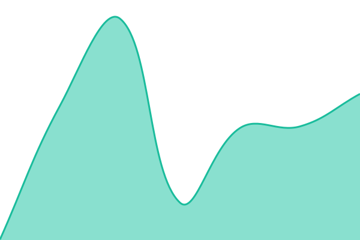

# [📈 Live Status](https://benemanuel.github.io/status): <!--live status--> **🟩 All systems operational**

This repository contains the open-source uptime monitor and status page for [Avi BenEmanuel](https://geulah.org.il), powered by [Upptime](https://github.com/upptime/upptime).

With [Upptime](https://upptime.js.org), you can get your own unlimited and free uptime monitor and status page, powered entirely by a GitHub repository. We use [Issues](https://github.com/benemanuel/status/issues) as incident reports, [Actions](https://github.com/benemanuel/status/actions) as uptime monitors, and [Pages](https://benemanuel.github.io/status) for the status page.

<!--start: status pages-->
<!-- This summary is generated by Upptime (https://github.com/upptime/upptime) -->
<!-- Do not edit this manually, your changes will be overwritten -->
<!-- prettier-ignore -->
| URL | Status | History | Response Time | Uptime |
| --- | ------ | ------- | ------------- | ------ |
|  [Geulah](https://geulah.org.il/) | 🟩 Up | [geulah.yml](https://github.com/benemanuel/status/commits/HEAD/history/geulah.yml) | 

 928ms
     
 | 

<a href="https://benemanuel.github.io/status/history/geulah">100.00%</a>
    

|  [HaTaNaCh](https://hatanach.geulah.org.il/) | 🟩 Up | [ha-ta-na-ch.yml](https://github.com/benemanuel/status/commits/HEAD/history/ha-ta-na-ch.yml) | 

 730ms
     
 | 

<a href="https://benemanuel.github.io/status/history/ha-ta-na-ch">100.00%</a>
    

|  [TaNaCh](https://tanach.geulah.org.il/) | 🟩 Up | [ta-na-ch.yml](https://github.com/benemanuel/status/commits/HEAD/history/ta-na-ch.yml) | 

 955ms
     
 | 

<a href="https://benemanuel.github.io/status/history/ta-na-ch">100.00%</a>
    

|  [Teamim](https://teamim.geulah.org.il/) | 🟩 Up | [teamim.yml](https://github.com/benemanuel/status/commits/HEAD/history/teamim.yml) | 

 1047ms
     
 | 

<a href="https://benemanuel.github.io/status/history/teamim">100.00%</a>
    

|  [ShirHaShirim](https://shirhashirim.org.il/) | 🟩 Up | [shir-ha-shirim.yml](https://github.com/benemanuel/status/commits/HEAD/history/shir-ha-shirim.yml) | 

 124ms
     
 | 

<a href="https://benemanuel.github.io/status/history/shir-ha-shirim">100.00%</a>
    

|  [Verse test](https://tanach.geulah.org.il/verse/?cit=Zeph3:8&text) | 🟩 Up | [verse-test.yml](https://github.com/benemanuel/status/commits/HEAD/history/verse-test.yml) | 

 629ms
     
 | 

<a href="https://benemanuel.github.io/status/history/verse-test">100.00%</a>
    

|  [blog](https://benemanuel.geulah.org.il/feed.xml) | 🟩 Up | [blog.yml](https://github.com/benemanuel/status/commits/HEAD/history/blog.yml) | 

 1017ms
     
 | 

<a href="https://benemanuel.github.io/status/history/blog">100.00%</a>
    

|  [plausible](https://plausible.geulah.org.il/) | 🟩 Up | [plausible.yml](https://github.com/benemanuel/status/commits/HEAD/history/plausible.yml) | 

 794ms
     
 | 

<a href="https://benemanuel.github.io/status/history/plausible">100.00%</a>
    

|  [oasis](https://benemanuel.space/) | 🟩 Up | [oasis.yml](https://github.com/benemanuel/status/commits/HEAD/history/oasis.yml) | 

 865ms
     
 | 

<a href="https://benemanuel.github.io/status/history/oasis">100.00%</a>
    

|  [test](https://test.geulah.org.il/) | 🟩 Up | [test.yml](https://github.com/benemanuel/status/commits/HEAD/history/test.yml) | 

 2033ms
     
 | 

<a href="https://benemanuel.github.io/status/history/test">100.00%</a>
    

|  [Who Are You Israel](https://whoareyouisrael.geulah.org.il/) | 🟩 Up | [who-are-you-israel.yml](https://github.com/benemanuel/status/commits/HEAD/history/who-are-you-israel.yml) | 

 682ms
     
 | 

<a href="https://benemanuel.github.io/status/history/who-are-you-israel">100.00%</a>
    

|  [Sky](https://sky.geulah.org.il/) | 🟩 Up | [sky.yml](https://github.com/benemanuel/status/commits/HEAD/history/sky.yml) | 

 854ms
     
 | 

<a href="https://benemanuel.github.io/status/history/sky">100.00%</a>
    

<!--end: status pages-->

[**Visit our status website →**](https://benemanuel.github.io/status)

## 📄 License

- Powered by: [Upptime](https://github.com/upptime/upptime)
- Code: [MIT](./LICENSE) © [Anand Chowdhary](https://anandchowdhary.com), supported by [Pabio](https://pabio.com)
- Data in the `./history` directory: [Open Database License](https://opendatacommons.org/licenses/odbl/1-0/)
